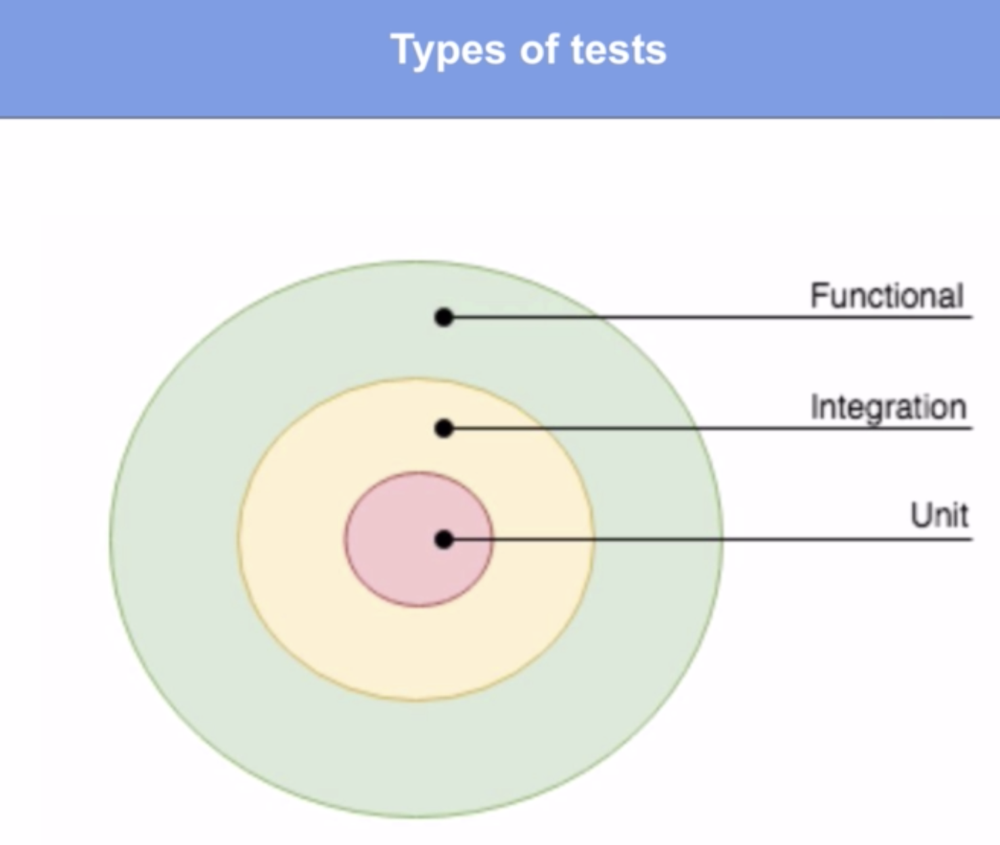
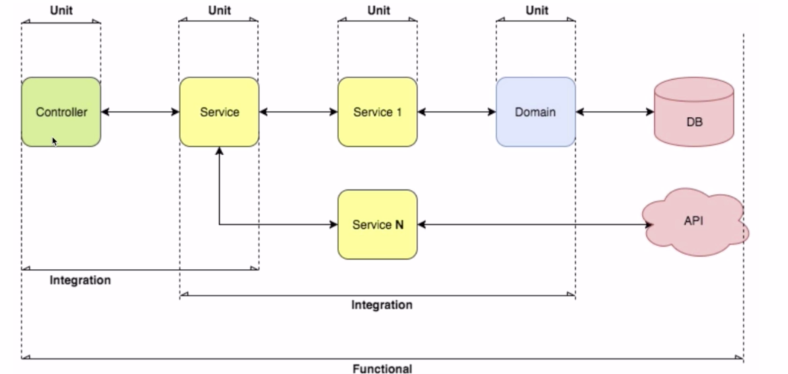
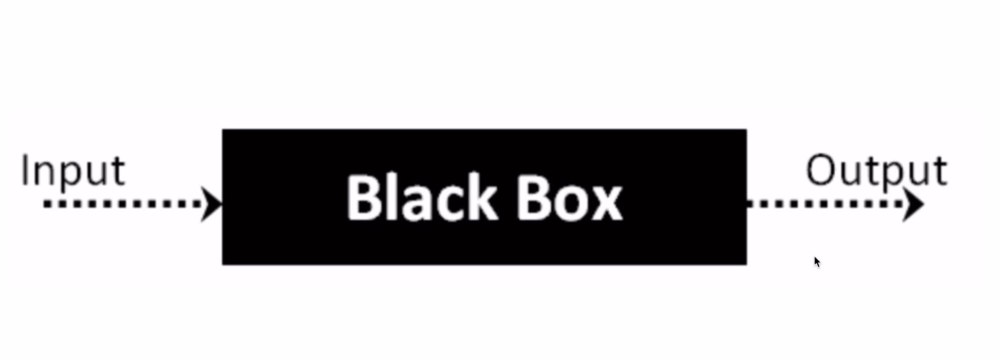

# Testing and Integration with go

## Unit Testing and Integration Testing
<!-- TOC -->

- [Testing and Integration with go](#testing-and-integration-with-go)
    - [Unit Testing and Integration Testing](#unit-testing-and-integration-testing)
        - [Course Repo](#course-repo)
        - [Types ofTesting](#types-oftesting)
        - [Artifacts of each Test Type](#artifacts-of-each-test-type)
        - [Pyramid of Tests](#pyramid-of-tests)
        - [Steps to follow when writing a test cast](#steps-to-follow-when-writing-a-test-cast)
        - [Test Coverage](#test-coverage)
        - [Benchmark Testing](#benchmark-testing)
    - [Assertions](#assertions)
        - [API Library](#api-library)
        - [http using Gin](#http-using-gin)
        - [Stretchr/testify](#stretchrtestify)
    - [Functional Test](#functional-test)
        - [Black Box Test](#black-box-test)
        - [Tests in In test folder](#tests-in-in-test-folder)
    - [Final Test Results](#final-test-results)

<!-- /TOC -->

### Course Repo

```sh
git clone https://github.com/federicoleon/golangTesting.git
```

### Types ofTesting



**Unit:** Test code to make sure functions and Modules work

- White boxTesting (best to encapsulate all logic inTesting)
- Black BoxTesting: without regard to code

**Integration:** Integrate the modules of teh application not periferal systems.

More than one module: within the program.

Be sure to validate end to end integrated components.

**Functional:**

User behavior
Rest APIs.
Not as rich or complete

**Systems:**

### Artifacts of each Test Type



### Pyramid of Tests


Tests must be delivered with the application

test must be in the package of the function they areTesting
File name file_test.go
Test Funtion Name starts with Test. Ex.
func TestFunctionName(t Testing.T) {
    //Init
    //Execute
    //Validate
}

### Steps to follow when writing a test cast

1. Initialization
2. Execution
3. Validation

**Run Test**
go test (everything in package)
go test -v .

### Test Coverage

go test -cover

```PASML-335382:sort jjacob151$ go test -cover
[9 7 5 3 1 2 4 8 0]
[9 8 7 5 4 3 2 1 0]
[9 7 5 3 1 2 4 6 8 0]
[0 1 2 3 4 5 6 7 8 9]
PASS
coverage: 100.0% of statements
ok      gotestingintegutils/sort      0.005s
PASML-335382:sort jjacob151$
```

The cover metric does not account for the type of validation used.
It verifies that each line of code is executed.
If there is no validation in the code the test may pass even if it is not correct.

Don't rely blindly on the coverage metric.

You must put good validation in the test case.

t.Error Statement will continue to execute after a fail condition.

[Project Integration](IntegrationTest.md)

### [Benchmark Testing](BenchmarkTest.md)

Bubble Sort is the worst possible type of Sort Algorithm. Compare to Native Sort using Benchmarks.
Test different approaches to solving a problem.

## [Assertions](https://drive.google.com/file/d/1r5q5i1sATsP510TCInQ6FhPjWbXVMUyt/view?usp=sharing)

Go Does not have assertions by default; you can create them with error statements.

github.com/stretcher/testify/assert

### [API Library](api/domain/locations/providerlocations/scenarios.md)

merdadolibre/golang-restclient

```go get github.com/mercadolibre/golang-restclient/rest```

[Countries API](https://api.mercadolibre.com/countries)

[Testing the API](api/domain/locations/providerlocations/provider_locations_test.go)

## [Mockups](api/domain/locations/providerlocations/provider_locations_test.go#L94)

```go test -mock```

[rest.StartMockupServer()](api/domain/locations/providerlocations/provider_locations_test.go)

### http using Gin

"github.com/gin-gonic/gin"

[CreateContext](api/controllers/controller_locations_test.go)

Controller call --> Service --> Provider --> API


### Stretchr/testify

has a mock package

```go
type myMockObject struct {
    mock.Mock
}
```

test.Obj.On("Do Something", 123).Return(true, nil)

github.com/stretchr/testify/mock

## Functional Test

Using MVC Model View Controller Architecture

CommandlineTesting

```sh
go test -cover
?       api      [no test files]
PASML-335382:api jjacob151$ cd controllers/
PASML-335382:controllers jjacob151$ go test -cover
Init Service
Init sort Service
[GIN-debug] [WARNING] Running in "debug" mode. Switch to "release" mode in production.
 - using env:   export GIN_MODE=release
 - using code:  gin.SetMode(gin.ReleaseMode)

&{{0xc000032440 -1 200} 0xc0002c6200 0xc00029a270 [{country_id AR}] [] -1  0xc0002c4120 map[]  [] map[] map[]}
Inside Controller
[GIN-debug] [WARNING] Running in "debug" mode. Switch to "release" mode in production.
 - using env:   export GIN_MODE=release
 - using code:  gin.SetMode(gin.ReleaseMode)

&{{0xc000032480 -1 200} 0xc000130d00 0xc000278410 [{country_id BR}] [] -1  0xc0000ecc60 map[]  [] map[] map[]}
Inside Controller
this is the result {BR Brasil 3.00+GMT {{0 0}} []}PASS
coverage: 100.0% of statements
ok      api/controllers  0.020s
```

### Black Box Test



Brief test run  

```sh
 go test .
ok      api/controllers  (cached)
```

Verbose Test Run

```sh
go test . -v
Init Service
Init sort Service
=== RUN   TestGetCountryNotFound
[GIN-debug] [WARNING] Running in "debug" mode. Switch to "release" mode in production.
 - using env:   export GIN_MODE=release
 - using code:  gin.SetMode(gin.ReleaseMode)

&{{0xc000266480 -1 200} 0xc0002b4200 0xc000278270 [{country_id AR}] [] -1  0xc0002ae120 map[]  [] map[] map[]}
Inside Controller
--- PASS: TestGetCountryNotFound (0.00s)
=== RUN   TestGetCountryNoError
[GIN-debug] [WARNING] Running in "debug" mode. Switch to "release" mode in production.
 - using env:   export GIN_MODE=release
 - using code:  gin.SetMode(gin.ReleaseMode)

&{{0xc0002664c0 -1 200} 0xc0002d2000 0xc0002b00d0 [{country_id BR}] [] -1  0xc0002d0000 map[]  [] map[] map[]}
Inside Controller
this is the result {BR Brasil 3.00+GMT {{0 0}} []}--- PASS: TestGetCountryNoError (0.00s)
PASS
ok      api/controllers  (cached)
```

### [Tests in In test folder](api/tests/base_test.go)

1. Put all tests in a single folder
2. Use one test main function
3. Run the application and use tests against the running application.


## Final Test Results 

```sh
$ go test -cover ./...
?       api      [no test files]
?       api/app  [no test files]
ok      api/controllers  (cached)        coverage: 100.0% of statements
?       api/domain/locations     [no test files]
ok      api/domain/locations/providerlocations   (cached)        coverage: 93.3% of statements
ok      api/services     0.016s  coverage: 50.0% of statements
ok      api/tests        (cached)        coverage: 0.0% of statements
?       api/utils/errors [no test files]
ok      api/utils/mysort 0.017s  coverage: 100.0% of statements
```